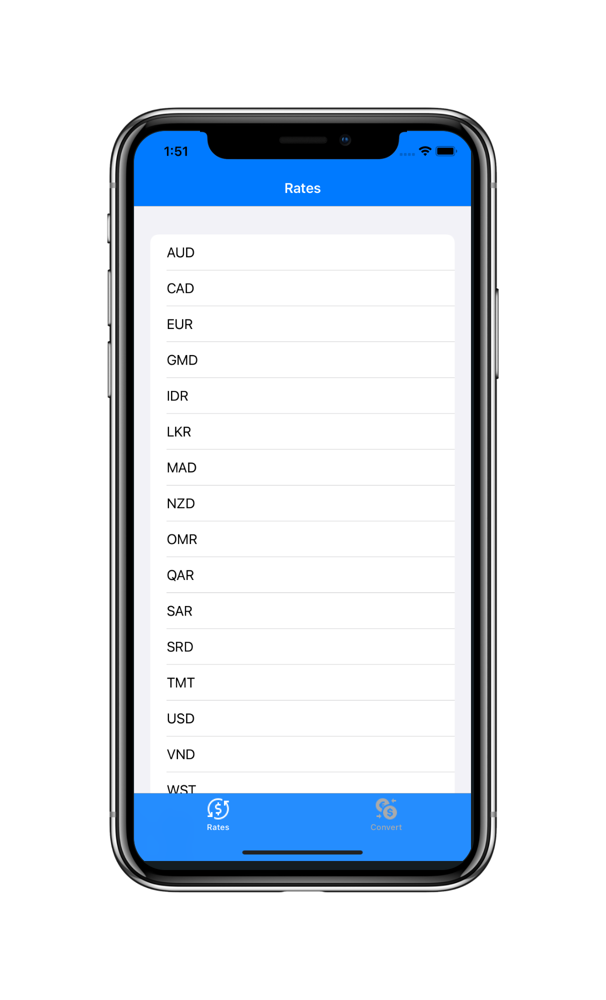
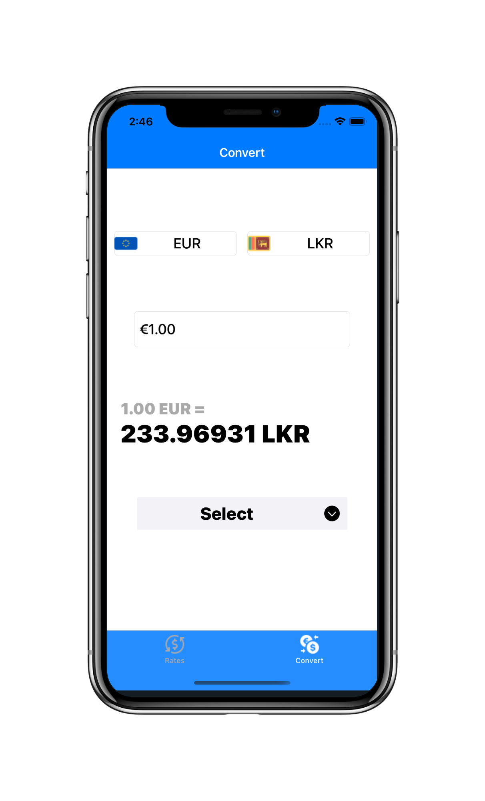
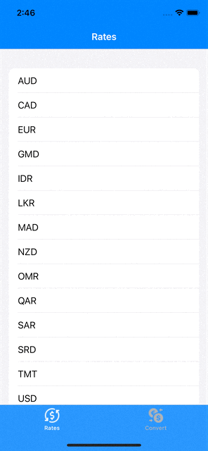

# CurrencyTracker

**Screenshots**

    

    

       

**Description**

* A simple app to get daily exchange rates and perform currency conversions

* Project was completed using 100% programmatic UI (No Storyboard)

* MVC design pattern

**Frameworks**

* UIKit
